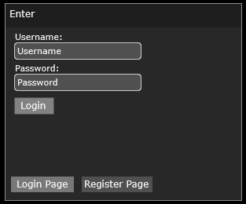
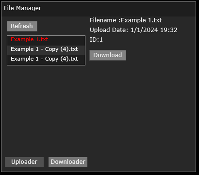
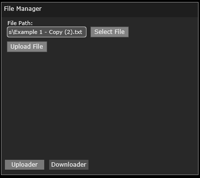

# RemoteFileManager
Tool for file storage on a remote server with user authentication. Allows you to store many different files securely within a single database under different users. 

## Images/ Video:

## Dependencies:
[OpenSSL](https://github.com/openssl/openssl)  
[Connector++](https://dev.mysql.com/downloads/connector/cpp/)

## Features:
* MySQL Server
* Dynamic Packets
* File Sending
* [GUI](https://github.com/IntelSDM/GUI-Framework)
* User Data Encryption
* Injection Prevention
